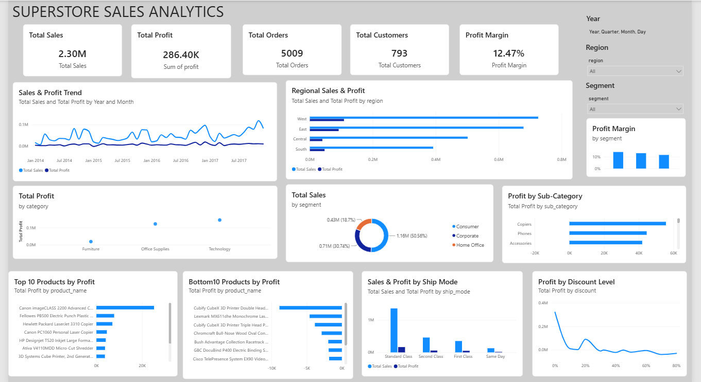

Yes. Here is the   complete  README.md  content in raw Markdown format  . You can copy everything inside the code block directly into your GitHub  README.md .

    markdown
  📊 Retail Performance Intelligence

>   End-to-end Business Intelligence & Analytics pipeline using Python, MySQL, SQL, Power BI and DAX  

   🚀 Overview

  Retail Performance Intelligence   is an end-to-end data analytics project that transforms raw retail transaction data into actionable business insights.

The project combines:

-   Python + Pandas   for data loading, cleaning, validation and exploratory analysis
-   MySQL   for structured data storage
-   SQL   for business analysis and KPI generation
-   Power BI + DAX   for interactive business intelligence and visualization

The analysis focuses on   sales performance, profitability, discount impact, product performance, customer behavior, regional performance, customer segments and shipping efficiency  .

The goal is not simply to visualize sales, but to understand   what drives revenue, what drives profit, and where profitability is being lost  .

---

   🏗️ End-to-End Architecture

   mermaid
flowchart TD
    A[Raw Retail Transaction Data] --> B[Python + Pandas]

    B --> B1[Data Loading]
    B --> B2[Data Cleaning]
    B --> B3[Data Validation]
    B --> B4[Exploratory Analysis]

    B --> C[MySQL]

    C --> C1[Structured Data Storage]
    C --> C2[Data Validation]

    C --> D[SQL Business Analysis]

    D --> D1[KPI Analysis]
    D --> D2[Profitability Analysis]
    D --> D3[Customer Analysis]
    D --> D4[Product Analysis]
    D --> D5[Regional Analysis]

    D --> E[Power BI + DAX]

    E --> E1[Interactive Dashboard]
    E --> E2[KPI Measures]
    E --> E3[Interactive Filters]

    E --> F[Business Insights]
    

---

  🎯 Business Objectives

The project was designed to answer practical business questions:

  How much sales and profit does the business generate?
  Which categories and sub-categories drive profitability?
  Which products generate the highest and lowest profit?
  Which regions perform best?
  Which customer segments are most profitable?
  How does discounting affect profitability?
  Which shipping modes perform best?
  Which customers generate the highest and lowest profit?
  How have sales and profit changed over time?
  Are there data-quality issues that could affect business decisions?

---

  🛠️ Technology Stack

| Technology       | Purpose                                                     |
| ---------------- | ----------------------------------------------------------- |
|   Python         | Data loading, cleaning, validation and exploratory analysis |
|   Pandas         | Data manipulation and analysis                              |
|   MySQL          | Structured relational data storage                          |
|   SQL            | Business analysis, aggregations and validation              |
|   Power BI       | Interactive dashboard and visualization                     |
|   DAX            | KPI calculations and analytical measures                    |
|   Git & GitHub   | Version control and project documentation                   |

---

  📁 Project Structure

   text
retail-performance-intelligence/
│
├── python/
│   ├── 01_load_data.py
│   ├── 02_data_cleaning.py
│   └── 03_sales_analysis.py
│
├── sql/
│   └── Superstore_Analytics.sql
│
├── powerbi/
│   └── Superstore_Sales_Analytics.pbix
│
├── screenshots/
│   └── dashboard.png
│
├── README.md
└── .gitignore
   

---

  📌 Dataset

The project uses a retail Superstore transaction dataset containing:

    9,994 records  
    21 attributes  

The dataset contains information related to:

  Orders
  Customers
  Products
  Categories
  Sub-Categories
  Sales
  Quantity
  Discounts
  Profit
  Regions
  Customer Segments
  Shipping Modes
  Order Dates

    Dataset Validation

   text
Rows:              9,994
Columns:              21
Missing Values:        0
   

---

  🐍 1. Python — Data Loading, Cleaning & Analysis

Python was used as the first analytical layer of the project.

   Data Loading

The raw CSV dataset was loaded using   Pandas   and validated against its expected structure.

   Data Cleaning

The data preparation process included:

  Checking dataset structure and column types
  Handling date-format issues
  Converting date fields into usable date formats
  Validating numerical columns
  Checking missing values
  Checking invalid discount values
  Checking invalid quantity values
  Validating sales and profit fields
  Preparing the dataset for MySQL ingestion

   Exploratory Analysis

Python was also used to investigate:

  Overall sales and profit
  Category performance
  Product profitability
  Discount behavior
  Yearly trends
  Monthly trends
  Top and bottom performing products

    Python Validation

   text
Rows:       9,994
Columns:       21
Missing:        0
   

The Python results were then used as a reference point for validating the MySQL and Power BI layers.

---

  🗄️ 2. MySQL — Data Layer

After validation and preparation, the dataset was loaded into MySQL.

   text
Database: superstore_db
Table:    superstore
   

The MySQL layer provides a structured environment for:

  Data storage
  SQL querying
  Business analysis
  Data validation
  Aggregation

    MySQL Validation

   text
Rows:       9,994
Sales:      2,297,200.8603
Profit:       286,397.0217
Quantity:      37,873
   

The results were cross-checked against the source dataset to ensure data consistency.

---

  🔎 3. SQL — Business Analysis

SQL was used to convert business questions into measurable analytical queries.

   Analysis Areas

  Overall business KPIs
  Category performance
  Sub-category profitability
  Discount analysis
  Product profitability
  Yearly performance
  Monthly performance
  Regional performance
  Customer segment performance
  Shipping performance
  Customer profitability
  Data-quality validation

   SQL Techniques Used

   text
SELECT
WHERE
GROUP BY
ORDER BY
LIMIT
SUM()
AVG()
COUNT()
COUNT(DISTINCT)
ROUND()
YEAR()
STR_TO_DATE()
DATE_FORMAT()
   

The complete SQL analysis is available in:

   text
sql/Superstore_Analytics.sql
   

---

  📊 4. Power BI — Interactive Dashboard

Power BI was used as the final business intelligence layer.

The dashboard connects to the   MySQL database using Import connectivity  .

   KPI Cards

The dashboard includes:

  Total Sales
  Total Profit
  Total Orders
  Total Customers
  Profit Margin

   Analytical Visuals

  Sales & Profit Trend
  Sales & Profit by Category
  Profit by Sub-Category
  Regional Sales & Profit
  Sales by Customer Segment
  Profit Margin by Segment
  Profit by Discount Level
  Sales & Profit by Shipping Mode
  Top 10 Products by Profit
  Bottom 10 Products by Profit

   Interactive Filters

  Year
  Region
  Customer Segment

---

  🧮 DAX Measures

The dashboard uses reusable DAX measures instead of hard-coded KPI values.

    Total Sales

   DAX
Total Sales =
SUM('superstore_db superstore'[sales])
   

    Total Profit

   DAX
Total Profit =
SUM('superstore_db superstore'[profit])
   

    Total Quantity

   DAX
Total Quantity =
SUM('superstore_db superstore'[quantity])
   

    Total Orders

   DAX
Total Orders =
DISTINCTCOUNT('superstore_db superstore'[order_id])
   

    Total Customers

   DAX
Total Customers =
DISTINCTCOUNT('superstore_db superstore'[customer_id])
   

    Profit Margin

   DAX
Profit Margin =
DIVIDE([Total Profit], [Total Sales])
   

    Average Order Value

   DAX
Average Order Value =
DIVIDE([Total Sales], [Total Orders])
   

---

  📈 Key Business Results

| KPI                     |      Result |
| ----------------------- | ----------: |
|   Total Sales           |   $2.297M   |
|   Total Profit          |   $286.4K   |
|   Total Orders          |     5,009   |
|   Total Customers       |       793   |
|   Total Quantity        |    37,873   |
|   Profit Margin         |    12.47%   |
|   Average Order Value   |   $458.61   |

---

  💡 Key Business Insights

   🥇 Technology Leads Overall Performance

Technology generated the highest total sales and profit among the three major categories.

This makes Technology the strongest category in terms of both:

  Revenue contribution
  Absolute profitability

---

   📦 Product Profitability Varies Significantly

The highest-profit product was:

  Canon imageCLASS 2200 Advanced Copier  

   text
Profit ≈ $25.2K
   

The largest loss-making product was:

  Cubify CubeX 3D Printer Double Head Print  

   text
Loss ≈ $8.9K
   

This demonstrates why product performance should be evaluated using   profitability as well as sales  .

---

   💸 Discounting Has a Major Profitability Impact

Several higher discount levels produced negative total profit.

Examples:

   text
0% discount   → +$321K profit
20% discount  → +$90K profit
30% discount  → -$10K loss
40% discount  → -$23K loss
70% discount  → -$40K loss
80% discount  → -$31K loss
   

The analysis shows that aggressive discounting is associated with substantially weaker profitability.

>   Business implication:   Discount strategies should be evaluated against profit and margin, not revenue alone.

---

   🌎 West Is the Strongest Region

The   West   region generated the highest:

  Total Sales
  Total Profit

This makes West the strongest region in terms of absolute financial contribution.

---

   👥 Largest Segment ≠ Highest Margin

The   Consumer   segment generated the highest absolute sales and profit.

However:

   text
Home Office → Highest Profit Margin
   

This demonstrates why both   absolute profit   and   profit margin   should be considered when evaluating customer segments.

---

   🚚 Shipping Volume ≠ Profitability Efficiency

  Standard Class   generated the highest:

  Sales
  Profit
  Number of Orders

However,   First Class   achieved the highest profit margin among the shipping modes analyzed.

This highlights the difference between   volume   and   profitability efficiency  .

---

   👤 Customer Profitability Requires More Than Revenue

The most profitable customer was:

  Tamara Chand  

   text
Profit ≈ $8.98K
   

The largest loss-making customer was:

  Cindy Stewart  

   text
Loss ≈ $6.63K
   

Some customers generated substantial sales while still producing losses.

>   Revenue alone does not indicate customer value.  

---

  🔍 Data Quality Validation

Data quality was checked across the analytical pipeline.

| Validation           |    Result |
| -------------------- | --------: |
| Total Rows           |   9,994   |
| Missing Order IDs    |       0   |
| Missing Customer IDs |       0   |
| Missing Sales        |       0   |
| Missing Profit       |       0   |
| Negative Sales       |       0   |
| Invalid Quantity     |       0   |
| Invalid Discount     |       0   |

Python and MySQL aggregate results were cross-checked before building the Power BI dashboard.

---

  🎯 Business Takeaways

    1. Protect Profit Margins

Higher discount levels should be monitored because several discount levels are associated with negative profitability.

    2. Investigate Loss-Making Products

Loss-making products should be reviewed across:

  Pricing
  Discounts
  Cost structure
  Demand
  Product strategy

    3. Evaluate Customers by Profitability

High-revenue customers are not necessarily high-profit customers.

    4. Look Beyond Revenue

Sales volume alone does not provide a complete picture of business performance.

Profit, margin, discounting and customer/product profitability provide a more complete view.

---

  📚 Skills Demonstrated

   Data Analytics

  Exploratory Data Analysis
  Data Cleaning
  Data Validation
  KPI Development
  Business Analysis
  Data Storytelling

   Python

  Python
  Pandas
  CSV Data Processing
  Data Validation
  Exploratory Analysis

   SQL & Databases

  MySQL
  Aggregations
  GROUP BY
  DISTINCT Analysis
  Date Functions
  Business Queries
  Data Quality Validation

   Business Intelligence

  Power BI
  DAX
  Interactive Dashboards
  KPI Cards
  Slicers
  Drill-down Analysis
  Business-focused Visualization

   Development Workflow

  Git
  GitHub
  End-to-end analytics workflow

---

  🚀 Future Improvements

Potential future extensions include:

  Customer Lifetime Value analysis
  RFM customer segmentation
  Sales forecasting
  Profitability prediction
  Advanced DAX time intelligence
  Automated Power BI refresh
  Geographic profitability analysis
  Executive KPI alerts
  Automated data pipeline

---

  🔮 Future Architecture

The project can be extended into a more automated retail intelligence platform:

   text
Historical Data
      ↓
Automated Data Pipeline
      ↓
Data Warehouse
      ↓
Advanced Analytics
      ↓
Forecasting
      ↓
Predictive Insights
      ↓
Executive Decision Support
   

---

  👨‍💻 Author

   Sharat Kalkeri

  Computer Science & Engineering  

    Focus Areas

 Data Analytics  ·  SQL  ·  Python  ·  Power BI  ·  Business Intelligence  ·  Cloud Technology 

---

  ⭐ Project Highlights

   text
9,994        Transactions analyzed
$2.297M      Total Sales
$286.4K      Total Profit
5,009        Orders
793          Customers
12.47%       Profit Margin
   

>   From raw retail transactions to business decisions — powered by Python, SQL, MySQL, Power BI and DAX.  

    

    One thing to check after pasting

Your screenshot   must actually be located at  :

   text
screenshots/dashboard.png
    

GitHub paths are case-sensitive. So if your screenshot currently has a name such as:

   text
Screenshot 2026-08-12 181031.png
   

either rename it to:

   text
dashboard.png
   

or change the README's first image line to the   exact filename  .

After saving the README:

   bash
git add README.md
git commit -m "Update README documentation"
git push
   

The uploaded version of your README already confirms the intended  screenshots/dashboard.png  structure, so this is the cleanest final arrangement. 
